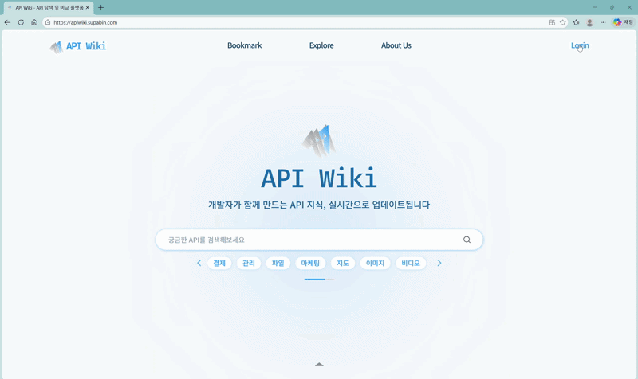
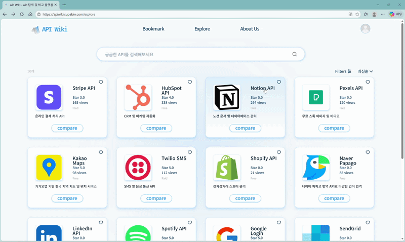
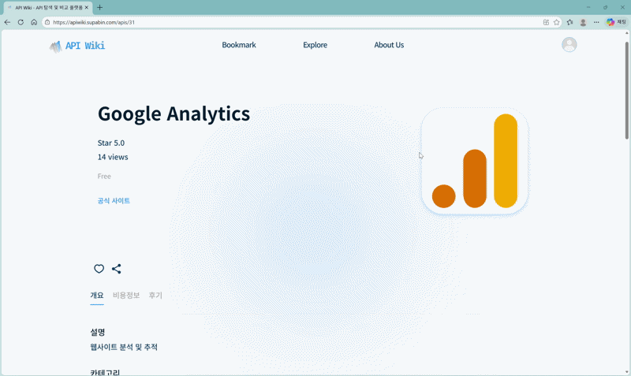
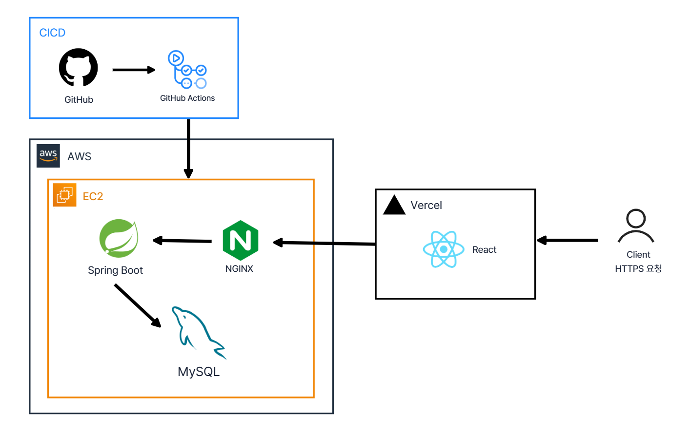

# 📚 API Wiki - Backend Server

> **최고의 API를 찾고 공유하세요!** <br/>
> **개발자들이 실제 사용 경험을 공유하며 함께 만드는 API 선택 가이드** <br/>
> **API Wiki의 백엔드 리포지토리입니다.**


<br/>

## 🔥 서비스 목표
API 위키는 개발자들이 프로젝트에 적합한 API를 빠르고 정확하게 선택할 수 있도록 돕는 커뮤니티 기반 정보 플랫폼입니다.

- **핵심 목표**: API 조사 시간을 8시간에서 2시간으로 70% 단축
- **품질 목표**: API 선택 후 교체율을 35%에서 10%로 감소
- **커뮤니티 목표**: 월간 활성 기여자 100명 이상 확보

<br/>

## 🎬 주요 기능 시연 (Demo)

**1. 로그인 및 다중 필터 검색**
> **JWT 기반 인증**과 **QueryDSL**을 활용한 동적 쿼리로 복잡한 조건에서도 빠르고 정확한 API 탐색을 제공합니다.


<br/>

**2. API 상세 조회 및 위키 편집 (동시성 제어)**
> 이미지를 포함한 모든 데이터를 손실 없이 서빙합니다. 위키 편집 시 발생할 수 있는 충돌을 **낙관적 락(Optimistic Lock)**으로 제어하여 데이터 정합성을 보장합니다.


<br/>

**3. 연관 API 추천 및 좋아요 (실시간 상태 반영)**
> 카테고리 연관 관계 매핑을 통해 유사 API를 추천하고 트랜잭션이 보장된 환경에서 사용자의 '좋아요' 상태 변경을 실시간으로 DB에 반영합니다.


<br/>

## 🏗️ Architecture (Infra & Deployment)

**AWS EC2** 환경에서 운영되며, **Nginx**를 활용해 보안과 트래픽 관리를 최적화했습니다.



* **Server URL:** `https://apiwiki-api.my-project.cloud`
* **Docs (Swagger):** [API 명세서 캡처본 보기](./docs/api/api-specification.pdf)

### 🔄 CI/CD Process
**GitHub Actions**를 통한 자동 배포 파이프라인이 구축되어 있습니다.
1. GitHub `main` 브랜치에 코드 Push
2. **GitHub Actions** 트리거 (Build & Test)
3. `.jar` 파일 빌드 후 AWS EC2로 전송
4. EC2 내부 배포 스크립트 실행 및 **Systemd**를 통한 서비스 재시작

> **⚠️ 배포 시 유의사항 (단일 인스턴스 환경)**
> 리소스 최적화를 위해 단일 인스턴스 배포 방식을 채택했습니다. 
> Nginx가 트래픽을 프록시하는 동안, 백엔드 프로세스 재시작 시 **약 5~15초의 최소화된 다운타임**이 발생합니다.

<br/>

## 💡 Technical Highlights (백엔드 핵심 성과)

* **배포 프로세스 고도화 및 안정성 확보**
  * 기존 쉘 스크립트(`nohup`)의 한계를 극복하고자 리눅스 **Systemd**를 도입하여, 프로세스 생명주기 관리 및 비정상 종료 시 자동 복구 환경 구축. [🔗 PR #20](https://github.com/umc-apiwiki/APIWIKI_BE_v1/pull/20)
* **유연한 보안 구성과 시크릿 관리**
  * `@ConditionalOnProperty`를 활용해 단일 코드베이스에서 로컬(H2)과 운영(RDS) 환경의 보안 설정을 유연하게 격리. [🔗 PR #22](https://github.com/umc-apiwiki/APIWIKI_BE_v1/pull/22)
  * GitHub Secrets, `.env`, Systemd `EnvironmentFile`을 연동한 안전한 환경변수 파이프라인 구축. [🔗 PR #4](https://github.com/umc-apiwiki/APIWIKI_BE_v1/pull/4)
* **데이터 전처리 자동화 및 코드 품질 관리**
  * 기획 데이터를 **Python 스크립트**로 파싱 및 가공하여 DB 맞춤형 포맷으로 마이그레이션 수행. [🔗 PR #43](https://github.com/umc-apiwiki/APIWIKI_BE_v1/pull/43)
  * PR 기반 코드 리뷰 문화를 정착시켜, N+1 문제 조기 발견 및 성능 최적화 진행. [🔗 PR #63](https://github.com/umc-apiwiki/APIWIKI_BE_v1/pull/63)

<br/>

## 🛠️ Getting Started (Local Development)

이 프로젝트를 로컬 환경에서 실행하기 위한 가이드입니다.

### 1. Prerequisites
* JDK 21 이상
* MySQL 8.0 이상

### 2. Installation
```bash
git clone https://github.com/umc-apiwiki/APIWIKI_BE_v1.git
cd apiwiki-backend
```

### 3. Environment Variables

보안을 위해 `application.yml`에 DB 접속 정보 등이 비워져 있습니다.<br/>
실행 시 아래 환경변수를 주입해야 정상 작동합니다.<br/><br/>

**[IntelliJ 설정 방법]**

1. 상단 실행 설정(`Run/Debug Configurations`) 클릭
2. `Modify options` → `Environment variables` 선택
3. 아래 내용을 입력

| Key | Description             | Example (Dummy) |
| --- |-------------------------|--------------|
| `DB_HOST` | RDS 엔드포인트 또는 로컬 주소      | `localhost`  |
| `DB_PORT` | 데이터베이스 포트               | `3306`       |
| `DB_NAME` | 스키마 이름                  | `apiwiki`    |
| `DB_USERNAME` | 데이터베이스 계정명              | `root`       |
| `DB_PASSWORD` | 데이터베이스 비밀번호             | `1234`       |
| `JWT_SECRET` | JWT 서명키 (32자 이상 필수) | `R0EIc9AX4k...` |

### 4. Build & Run

```bash
# Mac / Linux
./gradlew clean build
java -jar build/libs/apiwiki-backend-0.0.1-SNAPSHOT.jar

# Windows
./gradlew.bat clean build
java -jar build/libs/apiwiki-backend-0.0.1-SNAPSHOT.jar
```

<br/>

## 📂 Tech Stack

자세한 기술 선정 이유와 버전 전략은 **[Docs > Project Rules](./docs/project-rules.md)** 문서를 참고해주세요.

| Category | Stack                                               |
| --- |-----------------------------------------------------|
| **Language** | `Java 21`                                            |
| **Framework** | `Spring Boot 3.4.2`, `Spring Security`, `Spring Data JPA` |
| **Database** | `MySQL 8.0` (Prod), `H2` (Test) |
| **Infra** | `AWS EC2`, `RDS`                                       |
| **Web Server** | `Nginx` (Reverse Proxy, SSL/TLS) |
| **CI/CD** | `GitHub Actions`                                      |

## 🤝 Contribution

기여하시기 전에 반드시 아래 문서를 확인해주세요.

1. <b>[Ground Rules(협업 규칙)](./docs/project-rules.md)</b>을 먼저 읽어주세요.
2. <b>[Contributing Guide](./CONTRIBUTING.md)</b>에 따라 이슈와 PR을 생성해주세요.

