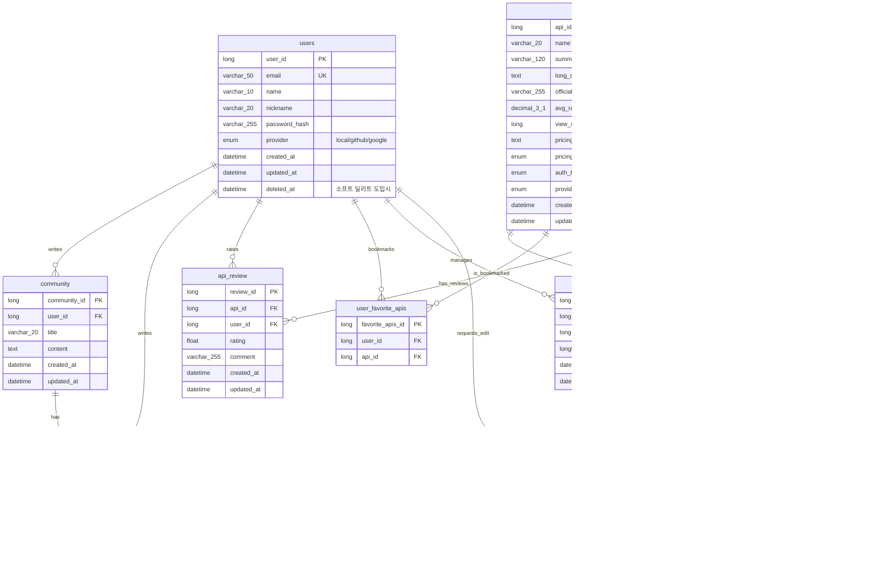

```mermaid
erDiagram
    users ||--o{ community : "writes"
    users ||--o{ comments : "writes"
    users ||--o{ api_review : "rates"
    users ||--o{ user_favorite_apis : "bookmarks"
    users ||--o{ wiki : "manages" 
    users ||--o{ wiki_edit_requests : "requests_edit"

    apis ||--o{ api_categories_map : "classified_as"
    category ||--o{ api_categories_map : "includes"
    
    apis ||--o{ user_favorite_apis : "is_bookmarked"
    apis ||--o{ api_review : "has_reviews"
    apis ||--|| wiki : "documented_by"
    
    wiki ||--o{ wiki_edit_requests : "has_history"
    community ||--o{ comments : "has"

    users {
        long user_id PK
        varchar_50 email UK
        varchar_10 name
        varchar_20 nickname
        varchar_255 password_hash 
        enum provider "local/github/google"
        datetime created_at
        datetime updated_at
        datetime deleted_at "소프트 딜리트 도입시"
    }

    apis {
        long api_id PK
        varchar_20 name
        varchar_120 summary
        text long_description
        varchar_255 official_url
        decimal_3_1 avg_rating
        long view_counts 
        text pricing_info "통합된 비용 정보(사람이 읽는 용도)"
        enum pricing_type "비용 필터링용(무료, 혼합, 유료)"
        enum auth_type "api 인증방식"
        enum provider_company "api 제공 회사"
        datetime created_at
        datetime updated_at
    }

    wiki {
        long wiki_id PK
        long api_id FK
        long user_id FK "creator_id"
        longtext content_md "초기값 NULL, 수정시 반영"
        datetime created_at
        datetime updated_at
    }

    wiki_edit_requests {
        long request_id PK
        long wiki_id FK
        long user_id FK "editor_id"
        enum state "검토중, 통과, 거절"
        longtext new_content_md "수정 요청 내용"
        datetime created_at "요청시간"
        enum reason "비속어, 내용부족 등에 관한 변경 이유"
    }

    category {
        long category_id PK
        enum name 
    }

    api_categories_map {
        long category_to_api_id PK
        long category_id FK
        long api_id FK
    }

    user_favorite_apis {
        long favorite_apis_id PK
        long user_id FK
        long api_id FK
    }

    api_review {
        long review_id PK
        long api_id FK
        long user_id FK
        float rating
        varchar_255 comment
        datetime created_at
        datetime updated_at
    }

    community {
        long community_id PK
        long user_id FK
        varchar_20 title
        text content
        datetime created_at
        datetime updated_at
    }

    comments {
        long comment_id PK
        long community_id FK
        long user_id FK
        varchar_255 comment
        datetime created_at
        datetime updated_at
    }
```