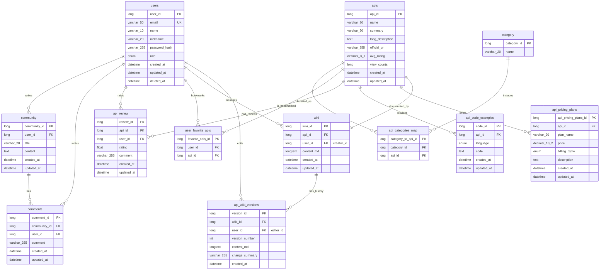

```mermaid
erDiagram
    users ||--o{ community : "writes"
    users ||--o{ comments : "writes"
    users ||--o{ api_review : "rates"
    users ||--o{ user_favorite_apis : "bookmarks"
    users ||--o{ wiki : "manages" 
    users ||--o{ api_wiki_versions : "edits"

    apis ||--o{ api_categories_map : "classified_as"
    category ||--o{ api_categories_map : "includes"
    
    apis ||--o{ user_favorite_apis : "is_bookmarked"
    apis ||--o{ api_review : "has_reviews"
    apis ||--o{ api_code_examples : "provides"
    apis ||--o{ api_pricing_plans : "offers"
    apis ||--|| wiki : "documented_by"
    
    wiki ||--o{ api_wiki_versions : "has_history"
    community ||--o{ comments : "has"

    users {
        long user_id PK
        varchar_50 email UK
        varchar_10 name
        varchar_20 nickname
        varchar_255 password_hash
        enum role
        datetime created_at
        datetime updated_at
        datetime deleted_at
    }

    apis {
        long api_id PK
        varchar_20 name
        varchar_50 summary
        text long_description
        varchar_255 official_url
        decimal_3_1 avg_rating
        long view_counts
        datetime created_at
        datetime updated_at
    }

    wiki {
        long wiki_id PK
        long api_id FK
        long user_id FK "creator_id"
        longtext content_md
        datetime created_at
        datetime updated_at
    }

    api_wiki_versions {
        long version_id PK
        long wiki_id FK
        long user_id FK "editor_id"
        int version_number
        longtext content_md
        varchar_255 change_summary
        datetime created_at
    }

    category {
        long category_id PK
        varchar_20 name
    }

    api_categories_map {
        long category_to_api_id PK
        long category_id FK
        long api_id FK
    }

    user_favorite_apis {
        long favorite_apis_id PK
        long user_id FK
        long api_id FK
    }

    api_review {
        long review_id PK
        long api_id FK
        long user_id FK
        float rating
        varchar_255 comment
        datetime created_at
        datetime updated_at
    }

    api_code_examples {
        long code_id PK
        long api_id FK
        enum language
        text code
        datetime created_at
        datetime updated_at
    }

    api_pricing_plans {
        long api_pricing_plans_id PK
        long api_id FK
        varchar_20 plan_name
        decimal_10_2 price
        enum billing_cycle
        text description
        datetime created_at
        datetime updated_at
    }

    community {
        long community_id PK
        long user_id FK
        varchar_20 title
        text content
        datetime created_at
        datetime updated_at
    }

    comments {
        long comment_id PK
        long community_id FK
        long user_id FK
        varchar_255 comment
        datetime created_at
        datetime updated_at
    }
```