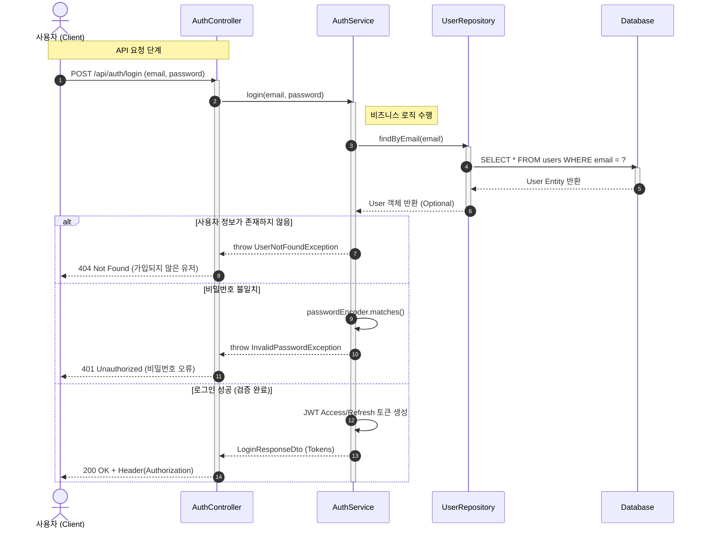

# (예시) Login

이 문서는 시스템의 시퀀스 다이어그램 작성 예시입니다.
사용자가 이메일과 비밀번호를 입력하여 로그인을 요청하는 과정을 나타냅니다.

```mermaid
sequenceDiagram
    autonumber
    
    actor User as 사용자 (Client)
    participant Controller as AuthController
    participant Service as AuthService
    participant Repo as UserRepository
    participant DB as Database

    Note over User, Controller: API 요청 단계
    User->>Controller: POST /api/auth/login (email, password)
    activate Controller
    
    Controller->>Service: login(email, password)
    activate Service

    Note right of Service: 비즈니스 로직 수행

    Service->>Repo: findByEmail(email)
    activate Repo
    Repo->>DB: SELECT * FROM users WHERE email = ?
    activate DB
    DB-->>Repo: User Entity 반환
    deactivate DB
    Repo-->>Service: User 객체 반환 (Optional)
    deactivate Repo

    alt 사용자 정보가 존재하지 않음
        Service-->>Controller: throw UserNotFoundException
        Controller-->>User: 404 Not Found (가입되지 않은 유저)
    else 비밀번호 불일치
        Service->>Service: passwordEncoder.matches()
        Service-->>Controller: throw InvalidPasswordException
        Controller-->>User: 401 Unauthorized (비밀번호 오류)
    else 로그인 성공 (검증 완료)
        Service->>Service: JWT Access/Refresh 토큰 생성
        Service-->>Controller: LoginResponseDto (Tokens)
        Controller-->>User: 200 OK + Header(Authorization)
    end

    deactivate Service
    deactivate Controller
```